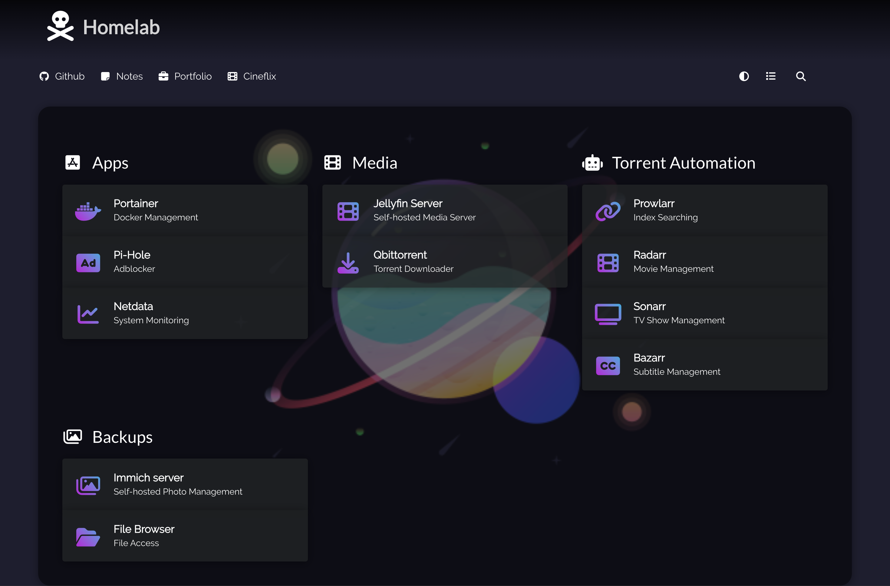

# Home Lab 
- Media server 
- File server
- Photos Backup 
- Network wide AdBlocking 
- Notification on Discord using webhooks. 

## Dashboard

 

## INFO: 

To access the server I am currently using tailscale.

To find userId and groupId of current user, `$(id -u)` and `$(id -g)`

## TODO: 

- [ ] Podcast server
- [ ] Book/Ebook reader 
- [ ] Identity provider
- [ ] Media Discovery Tool
- [ ] Monitoring Tools
